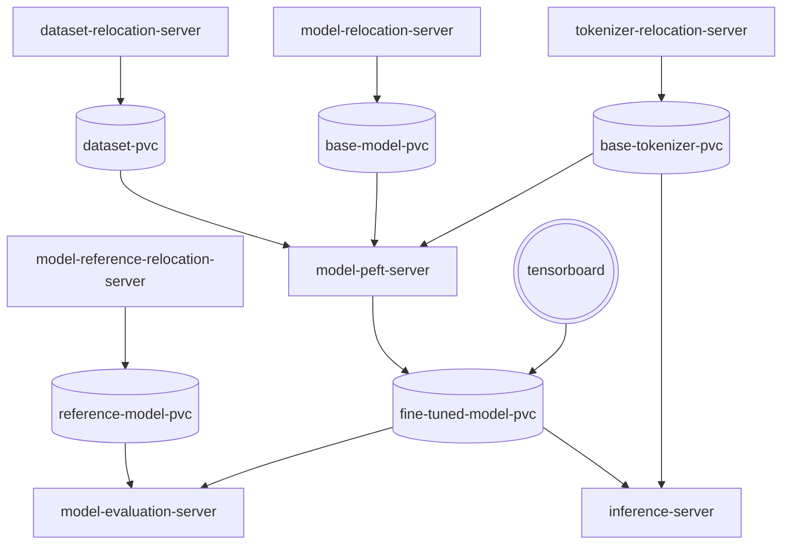
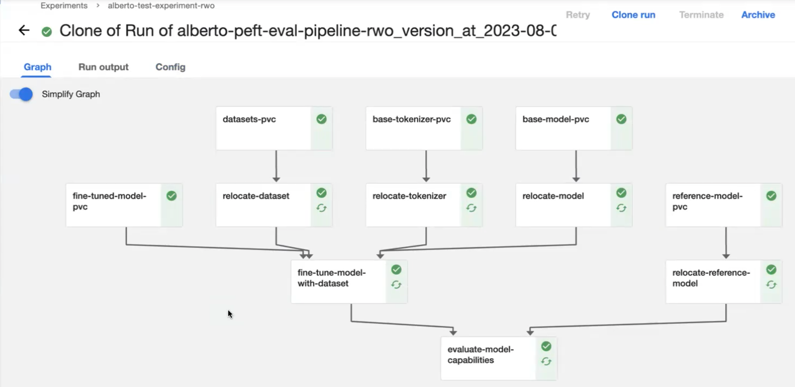
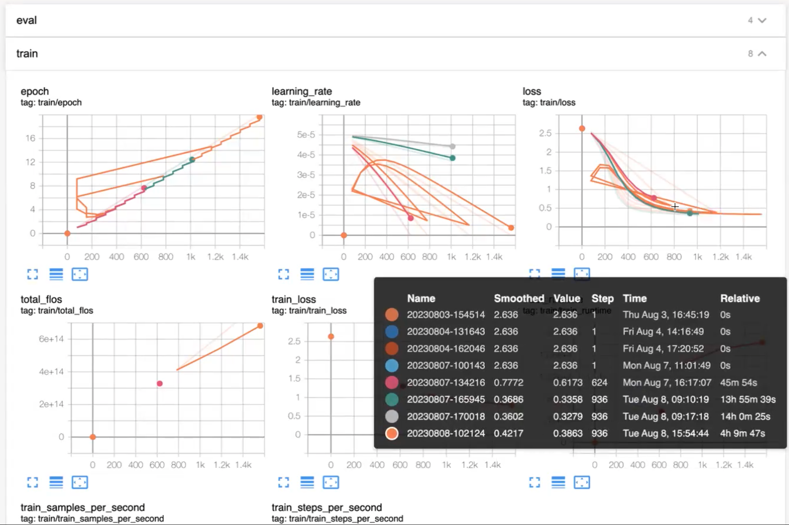

# Private Fine-Tuning

Privately fine-tune an LLM using Parameter Efficient Fine-Tuning with private data in any Kubernetes cluster and in
KubeFlow.



## Running locally with KinD

This project is not a complete end-to-end Machine Learning solution, all the main steps can be run locally
with KinD. Including models relocation, evaluation, fine-tuning, and inference.

### Downloading the models and tokenizers

To download the base and reference models and tokenizers, a script is provided that will automatically download `gpt2`
and `gpt2-large`:

To install the required script dependencies:

```bash
pip install -r scripts/requirements.txt
```

To run the script to download the models and tokenizers:

```bash
python ./scripts/download-models.py
```

### Creating the local cluster

Once the models and tokenizers are downloaded we can create our local KinD cluster:

```bash
kind create cluster
```

```bash
Creating cluster "kind" ...
 ✓ Ensuring node image (kindest/node:v1.27.3) 🖼
 ✓ Preparing nodes 📦
 ✓ Writing configuration 📜
 ✓ Starting control-plane 🕹️
 ✓ Installing CNI 🔌
 ✓ Installing StorageClass 💾
Set kubectl context to "kind-kind"
You can now use your cluster with:

kubectl cluster-info --context kind-kind
```

### Installing

With Skaffold everything can be built and run with one command for local iteration, the first time will take a while
because all the images are being created.

```bash
skaffold run --port-forward=true
```

> The evaluation server takes over 80 minutes in a CPU but since the inference server is created in parallel, we can use
> it while evaluation happens.


After running the `skaffold` command, it should display something like:

```bash
Waiting for deployments to stabilize...
 - deployment/model-inference-server is ready.
Deployments stabilized in 4.135 seconds
Port forwarding service/model-inference-service in namespace default, remote port 5000 -> http://127.0.0.1:5001
```

And the inference server is ready to receive requests:

```bash
 curl -XPOST 127.0.0.1:5001/prompt -d '{"input_prompt":"What is the best hotel in Seville?"}' -H 'Content-Type: application/json'
```

## Running in KubeFlow

KubeFlow automates all the creation of Kubernetes objects, and their synchronization and adds utilities to help us with
experiments and visualization in TensorBoard.

### Building the pipeline

[Using the notebook](kubeflow/GeneratePipeline.ipynb) or running [pipeline.py](kubeflow/pipeline.py)



### Visualising data in TensorBoard

Select the PVC from `fine-tuned-model-pvc`.
With the following mount path: `model/gpt2/logs/`.

> The mount path will vary depending on the chosen model.

> Since some environments can't easily create Persistent Volumes with `ReadWriteMany`, we have to wait for completion or
> to delete the board once we analyzed it.



## [Pushing components to registries](docs/registries.md)

At the moment, when running locally with KinD, it will load the images from a local registry, and when using KubeFlow,
the images will be downloaded from ghcr.io.
If you would like to use push your own images, [this guide](docs/registries.md) should cover everything.

## Parameter-Efficient Fine-Tuning

Parameter-Efficient Fine-Tuning (PEFT) methods enable efficient adaptation of pre-trained language models to
various downstream applications without fine-tuning all the model's parameters.

Enhancing a Large Language Model with knowledge and relations from private data can be challenging and the outcomes will
vary depending on the technique used. Retraining a whole model is not only a very costly operation, but it also can lead
to [Catastrophic Forgetting](https://arxiv.org/abs/2308.08747), making the model behave worse than before training.

Recent State-of-the-Art PEFT techniques achieve performance comparable to that of full fine-tuning.
For this example, we have chosen [LoRA: Low-Rank Adaptation of Large Language Models](https://arxiv.org/abs/2106.09685)
to freeze some of the parameters or just add new ones on top, that way the trainable weights are smaller, and the
fine-tuning can be
done in a single GPU, and it will be less prone to catastrophic forgetting.
The LoRa rank chosen for this experiment was 16, but it should have been treated as a hyperparameter since, according to
the paper, with a rank of 4 or 8 should perform well for our use case.

## Model evaluation

The evaluation of Large Language Models is still in an early stage of development and an active area of research.

The evaluation performed in `model-evaluation-server` evaluates the model capabilities, in order to understand if we are
improving or not and by how much.

For this reason, we are not only using our base and fine-tuned models but also a reference model with larger
capabilities than our base one.

### Recall-Oriented Understudy for Gisting Evaluation

[ROUGE](https://www.microsoft.com/en-us/research/wp-content/uploads/2016/07/was2004.pdf) is a set of metrics used for
evaluating automatic summarization and machine translation.
This metric helps determine the quality of a summary by comparing it to other summaries created by humans.

### General Language Understanding Evaluation with Corpus of Linguistic Acceptability

[GLUE](https://arxiv.org/pdf/1905.00537.pdf) is a collection of resources for training, evaluating, and analyzing
natural language understanding systems.
We have used The Corpus of Linguistic Acceptability, or COLA, consists of English acceptability judgments drawn
from books and journal articles on linguistic theory.
To help us determine whether the output of the LLM is a grammatically correct English sentence.

### Perplexity

The [Perplexity score](https://en.wikipedia.org/wiki/Perplexity) is one of the most common metrics for evaluating LLMs.
It measures how much the model was perplexed after seeing new data. The lower the perplexity, the better the training
went.
There are some
interesting [correlation of word error rate and perplexity](https://www.sciencedirect.com/science/article/abs/pii/S0167639301000413?via%3Dihub).


